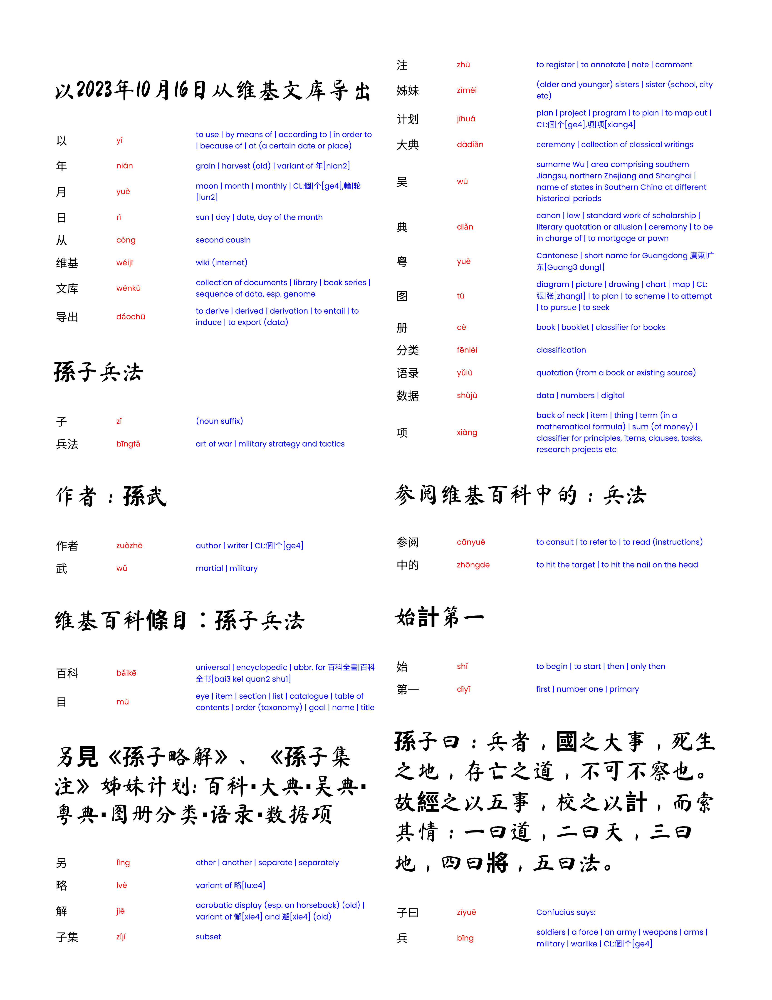
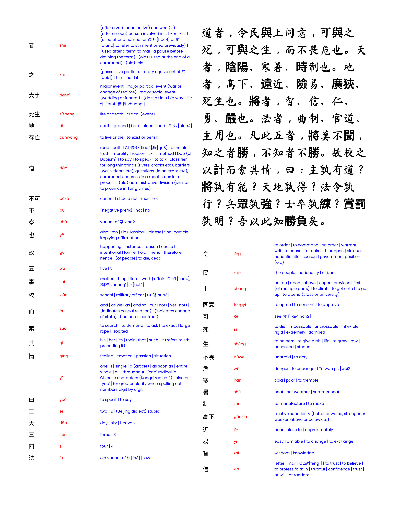
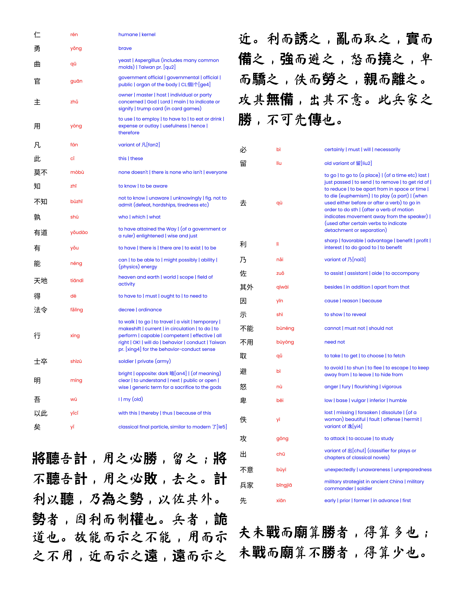

# 辅助轮 (FuZhuLun)
For English speakers who wish to learn Mandarin Chinese: a Python script that formats Mandarin Chinese text and augments new words with Pinyin and English.

This prototype uses a text file to generate a print-friendly HTML page designed to fit A4 or US letter-sized paper. Each paragraph is printed in a large, easy-to-read font, and under each paragraph is a table of new words in Chinese, Pinyin, and English.

If crafting regular expressions is your thing, it is also possible to configure the script look for "chapters," checkpoints where all words will be reviewed again.

## Directions

1. Install Python with [BeautifulSoup](https://pypi.org/project/beautifulsoup4/) and [Pinyin](https://pypi.org/project/pinyin/)

2. Create or find a file that contains Chinese text. Note that other languages will be printed in large font too, including English, Spanish, CSS, and HTML.

3. The first lines of the script allow users to configure the layout. Replace INPUT_FILE with the relative path to your input and OUTPUT_FILE with the desired output path.

NEW_CHAPTER_PATTERN can either be `None` or a regular expression (in the form `re.compile(r'<insert_pattern_here>', re.DOTALL)`). Word definitions will only be printed once per chapter, immediately after the first paragraph in which it's used. (`None` will only print each definition once.)
```py
INPUT_FILE  = 'Your text file here'
OUTPUT_FILE = 'A new HTML file will go here'
ENCODING = 'utf-8'
NEW_CHAPTER_PATTERN = None
NEW_PARAGRAPH_PATTERN = re.compile(r'(?<=\n\n)(.*?)\n\n', re.DOTALL)
# Use the following pattern to split the text into sentences
# NEW_PARAGRAPH_PATTERN = re.compile(r'(?<=\n\n)(.*?[。！？])(?=\n\n)', re.DOTALL)


# Customize the document style and formatting here
CSS_STYLE = '''
...
HTML stylesheet here
...
'''
```

4. Run the script: `python reformat.py`. An HTML file should have been generated.

5. Open the new HTML file. It's path is the same once set in `OUTPUT_FILE`

6. Print the generated HTML document. For best viewing experience online, consider printing as a PDF.


## Contributing

The journey to learning Mandarin can be hard and very rewarding. I wish you the best of luck and hope you've found this tool helpful for your studies.

Please use this script however you see fit. If you believe a change might help someone understand/use the script later, please don't hesitate to submit a pull request here. Bug reports are welcome too.

## Sample

The following is an excerpt generated from Sun Tzu's *Art of War*, generously provided on [Wikisource](https://zh.wikisource.org/wiki/%E5%AD%AB%E5%AD%90%E5%85%B5%E6%B3%95) under the [Creative Commons Attribution-ShareAlike License](https://creativecommons.org/licenses/by-sa/4.0/deed.en)






